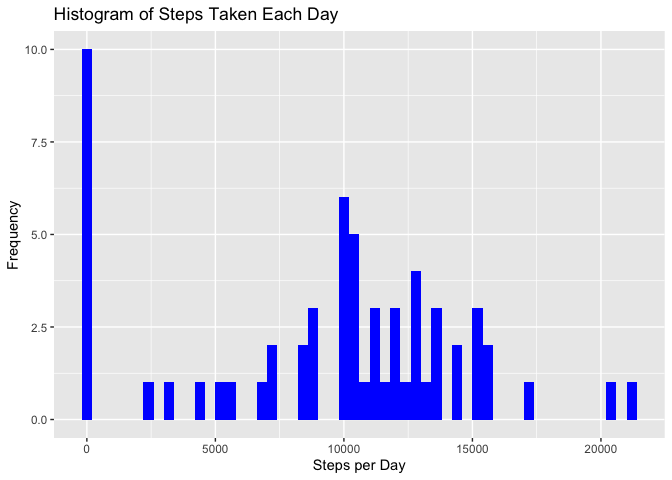
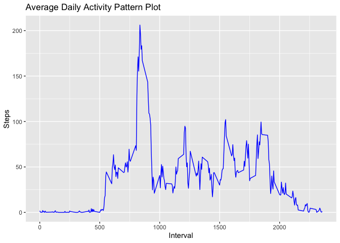
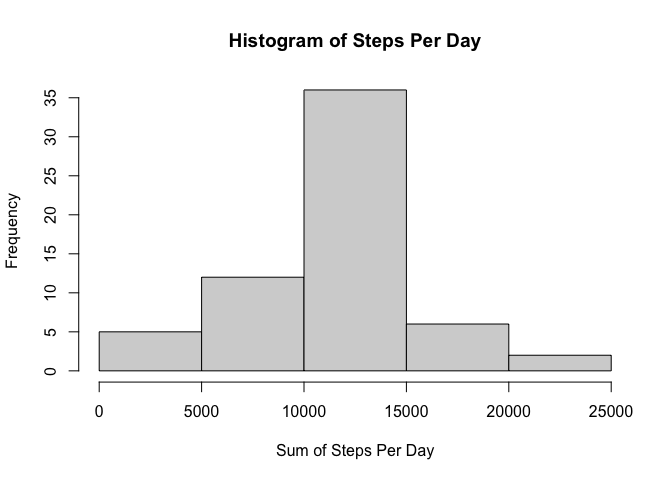

Course Project 1
================

# **Preliminary R settings**

The following code is used to set the directory and enable required
libraries:

``` r
library(lubridate)
```

    ## 
    ## Attaching package: 'lubridate'

    ## The following objects are masked from 'package:base':
    ## 
    ##     date, intersect, setdiff, union

``` r
library(dplyr)
```

    ## 
    ## Attaching package: 'dplyr'

    ## The following objects are masked from 'package:stats':
    ## 
    ##     filter, lag

    ## The following objects are masked from 'package:base':
    ## 
    ##     intersect, setdiff, setequal, union

``` r
library(stats)
library(ggplot2)
library(lattice)
setwd("~/Desktop/R_Coursera/WEEK2Assignment")
```

# **Loading and preprocessing the data**

Here it is the code for loading the data and correctly set the format of
the “date” column:

``` r
mydata<-read.csv('activity.csv')
mydata$date<-as.Date(mydata$date)
```

# **What is mean total number of steps taken per day?**

Then, I can group my dataset by date and compute the sum of steps taken
for each day with the following line of
code:

``` r
dailysteps<-mydata %>% group_by(date) %>% summarize(dsteps=sum(steps, na.rm = TRUE))
```

    ## `summarise()` ungrouping output (override with `.groups` argument)

Once grouped and summed up, I can easily plot the histogram of the total
number of steps taken each day using this code:

``` r
ggplot(dailysteps, aes(x = dsteps)) + 
      geom_histogram(fill = "blue", binwidth = 400) + 
      labs(title = "Histogram of Steps Taken Each Day", 
           x = "Steps per Day", y = "Frequency")
```

<!-- -->

The mean and median of the total number of steps taken per day are
respectively:

``` r
mn<-mean(dailysteps$dsteps)
print(c("Mean: ", mn))
```

    ## [1] "Mean: "           "9354.22950819672"

``` r
mdn<-median(dailysteps$dsteps)
print(c("Median: ", mdn))
```

    ## [1] "Median: " "10395"

# **What is the average daily activity pattern?**

This code for generating the time series plot of the 5-minute interval
(x-axis) and the average number of steps taken, averaged across all days
(y-axis):

``` r
intervalsteps <- mydata %>% group_by(interval) %>% summarize(dsteps=mean(steps, na.rm = TRUE))
```

    ## `summarise()` ungrouping output (override with `.groups` argument)

``` r
colnames(intervalsteps) <- c("interval", "steps")


ggplot(intervalsteps, aes(x = interval, y = steps)) + 
      geom_line(col = "blue", size = 0.5) + 
      labs(title = "Average Daily Activity Pattern Plot", x = "Interval", y = "Steps")
```

<!-- -->

Which 5-minute interval, on average across all the days in the dataset,
contains the maximum number of steps?

``` r
maxinterval <- intervalsteps[which.max(intervalsteps$steps),]
maxinterval
```

    ## # A tibble: 1 x 2
    ##   interval steps
    ##      <int> <dbl>
    ## 1      835  206.

# **Imputing missing values**

To calculate and report the total number of missing values in the
dataset (i.e. the total number of rows with NA):

``` r
missingvalues <- sum(is.na(mydata$steps))
print(c("The total number of missing values is: ", missingvalues))
```

    ## [1] "The total number of missing values is: " "2304"

A strategy that can be adopted in order to remove missing values is to
fill with the mean of that interval in the other days. The filled
dataset is created with the following code:

``` r
means <- tapply(mydata$steps, mydata$interval, mean, na.rm=T)
filledmydata <- mydata  # creation of the dataset that will have no more NAs
for (i in 1:nrow(mydata)){
      if(is.na(filledmydata$steps[i])){
            filledmydata$steps[i]<- means[[as.character(mydata[i, "interval"])]]
      }
}
```

To make a histogram of the total number of steps taken each day and
Calculate and report the mean and median total number of steps taken per
day we can use the following
code:

``` r
intervalstepsfilled <- tapply(filledmydata$steps, filledmydata$date, sum, na.rm=T)
hist(intervalstepsfilled, xlab = "Sum of Steps Per Day", main = "Histogram of Steps Per Day")
```

<!-- -->

Do these values differ from the estimates from the first part of the
assignment? What is the impact of imputing missing data on the estimates
of the total daily number of steps?

``` r
mnfilled <- round(mean(intervalstepsfilled))
mdnfilled <- round(median(intervalstepsfilled))
print(c("The mean of original and filled data is respectively ", mn, " and ", mnfilled))
```

    ## [1] "The mean of original and filled data is respectively "
    ## [2] "9354.22950819672"                                     
    ## [3] " and "                                                
    ## [4] "10766"

``` r
print(c("The median of original and filled data is respectively ", mdn, " and ", mdnfilled))
```

    ## [1] "The median of original and filled data is respectively "
    ## [2] "10395"                                                  
    ## [3] " and "                                                  
    ## [4] "10766"

# **Are there differences in activity patterns between weekdays and weekends?**

I create a factor variable that can assume the “weekday” and “weekend”
values.

``` r
filledmydata$weekday <- c("weekday")
filledmydata[weekdays(as.Date(filledmydata[, 2])) %in% c("Saturday", "Sunday", "sabato", "domenica", "saturday", "sunday", "Sabato", "Domenica"), ][4] <- c("weekend")
table(filledmydata$weekday == "weekend")
```

    ## 
    ## FALSE  TRUE 
    ## 12960  4608

``` r
filledmydata$weekday <- factor(filledmydata$weekday)
```

We can conclude that 4608 observations are related to the weekend, and
12960 to
weekdays.

``` r
filled_weekend <- subset(filledmydata, filledmydata$weekday == "weekend")
filled_weekday <- subset(filledmydata, filledmydata$weekday == "weekday")

mean_weekday <- tapply(filled_weekday$steps, filled_weekday$interval, mean)
mean_weekend <- tapply(filled_weekend$steps, filled_weekend$interval, mean)
```

I prepare the data frame, for easing the plotting, and I finally make
the plot.

``` r
df_weekday <- NULL
df_weekend <- NULL
df_final <- NULL
df_weekday <- data.frame(interval = unique(filled_weekday$interval), avg = as.numeric(mean_weekday), day = rep("weekday", length(mean_weekday)))
df_weekend <- data.frame(interval = unique(filled_weekend$interval), avg = as.numeric(mean_weekend), day = rep("weekend", length(mean_weekend)))
df_final <- rbind(df_weekday, df_weekend)

xyplot(avg ~ interval | day, data = df_final, layout = c(1, 2), 
       type = "l", ylab = "Number of steps")
```

<!-- -->

The behavior seems slightly different between weekend and weekdays.
